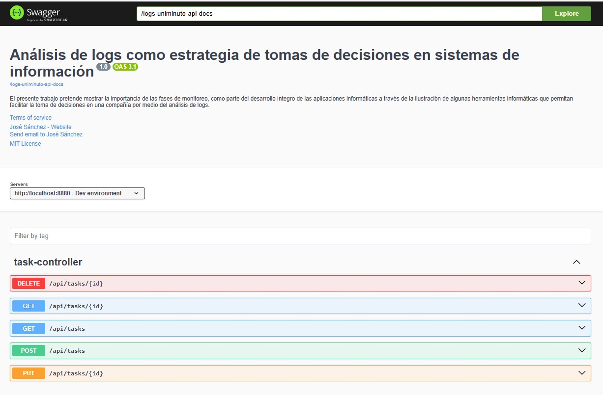
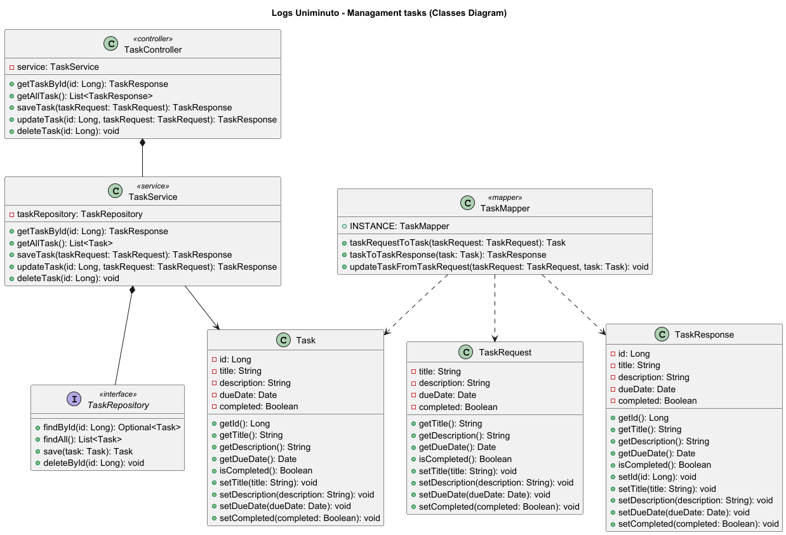
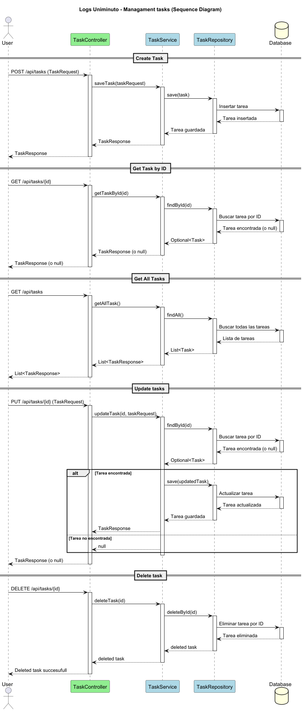

**README.md**

# Análisis de logs como estrategia de tomas de decisiones en sistemas de información

## Docentes: José Danilo Sánchez Torres, Edgardo Samuel Barraza Verdesoto y Ericka Alexandra Jiménez Rodríguez

El presente trabajo pretende mostrar la importancia de las fases de monitoreo, como parte del desarrollo íntegro de las aplicaciones informáticas a través de la ilustración de algunas herramientas informáticas que permitan facilitar la toma de decisiones en una compañía por medio del análisis de logs.

## Requisitos Previos

* **Java Development Kit (JDK) 17 o superior:** Asegúrate de tener Java instalado y configurado correctamente en tu sistema.
* **Gradle 7.0 o superior:** Gradle se utiliza para la gestión de dependencias y la construcción del proyecto.
* **IDE (Opcional):** Se recomienda utilizar un IDE como IntelliJ IDEA o Eclipse para facilitar el desarrollo.
* **Base de datos (Opcional):** Si tu aplicación interactúa con una base de datos, asegúrate de tenerla instalada y configurada.

## Configuración

Las propiedades de la aplicación se encuentran en el archivo `src/main/resources/application.properties`.

### Propiedades Comunes

* **`server.port`**: Puerto en el que se ejecutará la aplicación.
* **`spring.datasource.url`**: URL de la base de datos (si aplica).
* **`spring.datasource.username`**: Nombre de usuario de la base de datos (si aplica).
* **`spring.datasource.password`**: Contraseña de la base de datos (si aplica).
* **`spring.jpa.hibernate.ddl-auto`**: Estrategia de generación de esquemas de Hibernate.

### Ejemplo de `application.properties`

```properties
server.port=8583
spring.datasource.url=jdbc:mysql://localhost:3306/logs-uniminuto-test
spring.datasource.username=root
spring.datasource.password=password
spring.jpa.hibernate.ddl-auto=update
```


### OpenAPI (Swagger)

La configuración de OpenAPI se encuentra en `src/main/java/edu/uniminuto/logs_uniminuto/config/OpenAPIConf.java`. Puedes personalizar la información de la API según tus necesidades.

## Compilación

Para compilar el proyecto, ejecuta el siguiente comando en la raíz del proyecto:

```bash
./gradlew clean build
```

Este comando descargará las dependencias, compilará el código fuente y creará un archivo JAR ejecutable en el directorio `build/libs`.

## Ejecución

### Ejecución desde la línea de comandos

Para ejecutar la aplicación desde la línea de comandos, navega hasta el directorio `build/libs` y ejecuta el siguiente comando:

```bash
java -jar logs-uniminuto-0.0.1-SNAPSHOT.jar
```

Reemplaza `logs-uniminuto-0.0.1-SNAPSHOT.jar` con el nombre real del archivo JAR generado.

### Ejecución desde el IDE

También puedes ejecutar la aplicación directamente desde tu IDE. Busca la clase `TiendaMascotasApplication.java` en el paquete `edu.uniminuto.pa.sesion7.tienda_mascotas` y ejecútala como una aplicación Java.

## Pruebas

Para ejecutar las pruebas unitarias, ejecuta el siguiente comando en la raíz del proyecto:

```bash
./gradlew test
```

## Documentación de la API

La documentación de la API se genera automáticamente utilizando OpenAPI (Swagger). Puedes acceder a ella en la siguiente URL después de ejecutar la aplicación:

```
http://localhost:8880/swagger-ui/index.html#/
```



## Dependencias

Las dependencias del proyecto se gestionan con Gradle y se definen en el archivo `build.gradle`.

## Estructura del Proyecto

```
logs-uniminuto/
src/
├── main/
│   ├── java/
│   │   └── edu/
│   │       └── uniminuto/
│   │               └── logs-uniminuto/
│   │                   ├── configuracion/
│   │                   │   ├── OpenAPIConf.java
│   │                   │   └── WebConfig.java
│   │                   ├── controlador/
│   │                   │   ├── TaskController.java
│   │                   │   └── payloads/
│   │                   ├── mappers/
│   │                   │   ├── TaskMapper.java
│   │                   ├── model/
│   │                   │   ├── repositories/
│   │                   │   │   ├── TaskRepository.java
│   │                   │   ├── services/
│   │                   │   │   ├── TaskService.java
│   │                   │   └── Task.java
│   │                   └── LogsUniminutoApplication.java
│   ├── resources/
│   │   ├── application.properties
│   │   ├── static/
│   │   └── templates/
└── test/
```

## Ejecución desde navegador

En la carpeta docs se encuentran dos archivos con formato HTML, los cuales pueden ser utilizados para ser probados los servicios web de la aplicación de tiendas de mascotas:

### Classes diagram


### Sequence diagram


